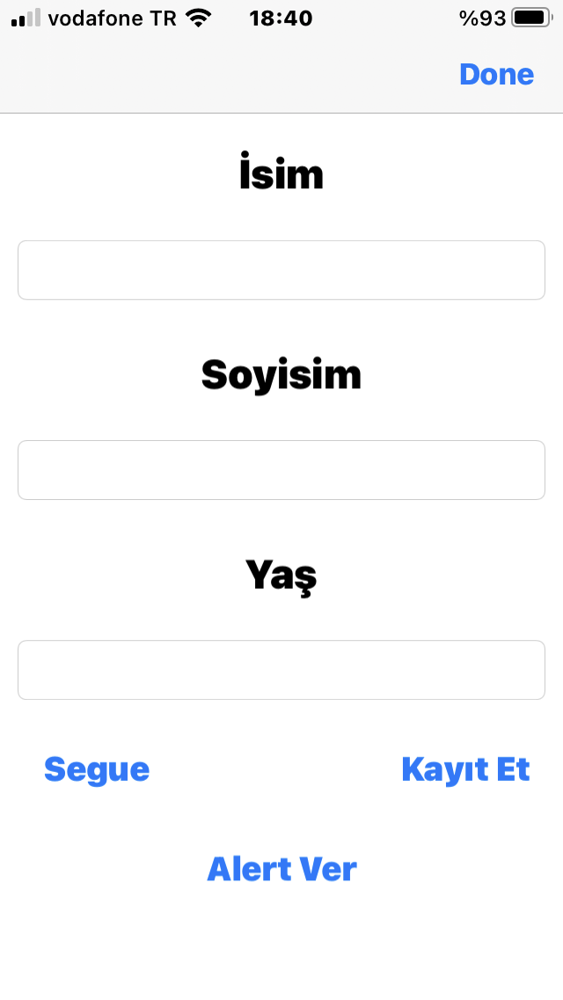
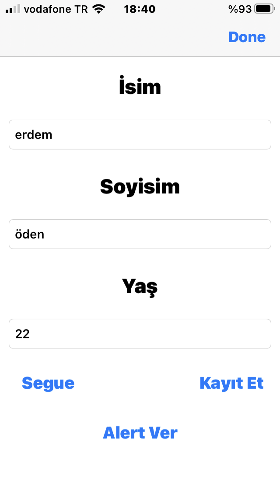
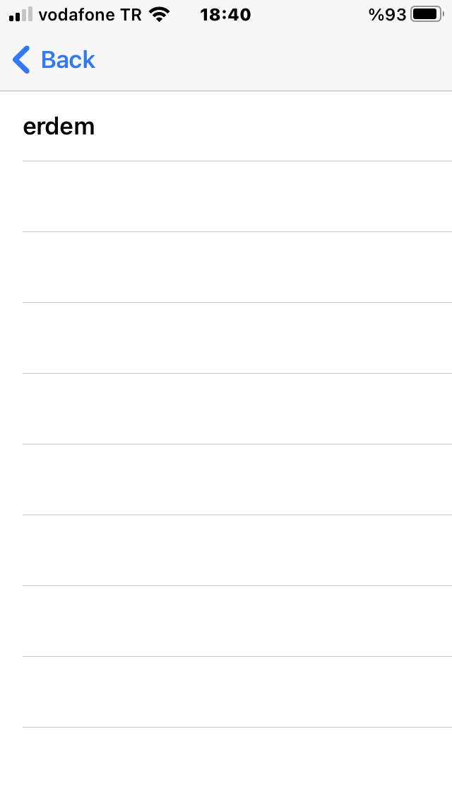
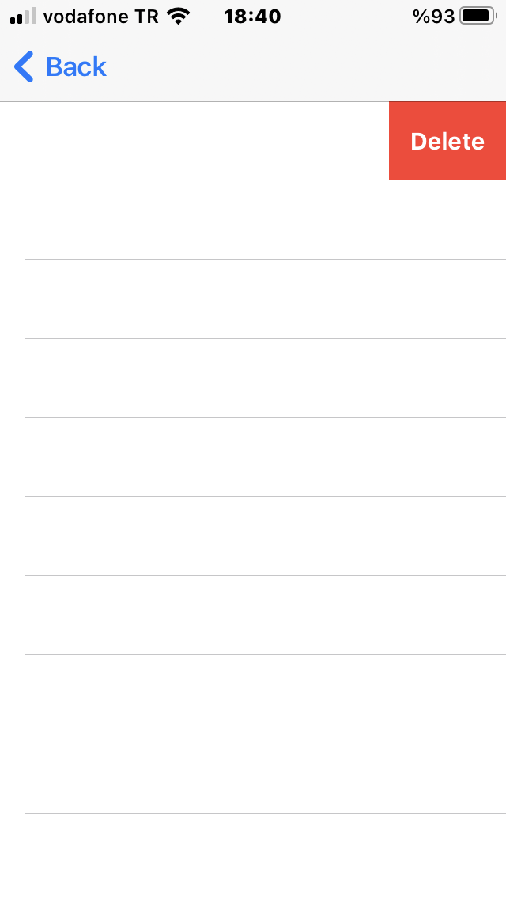
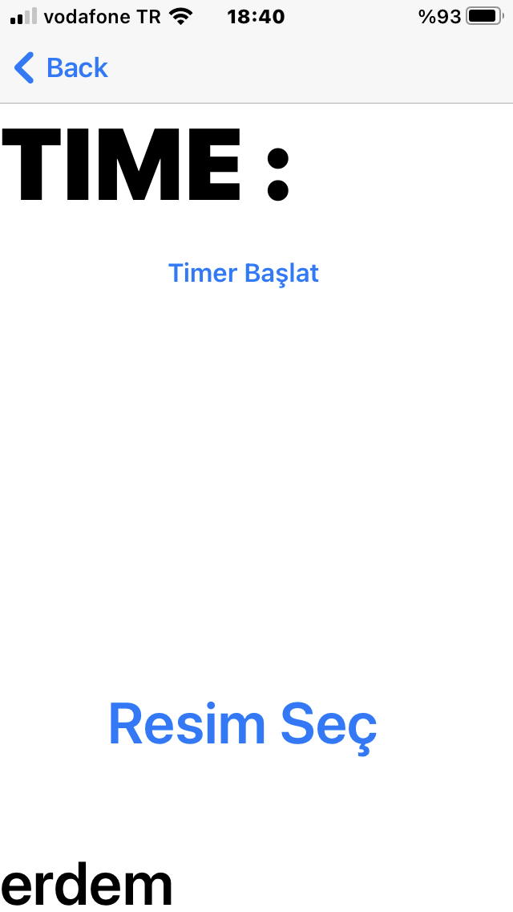
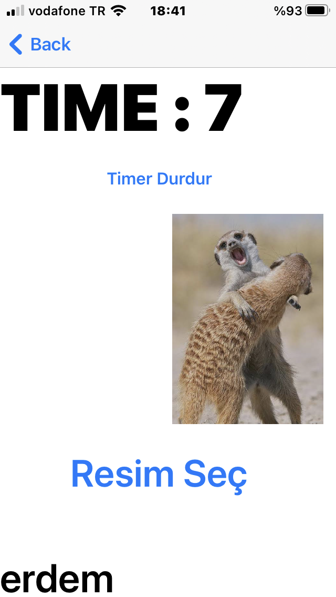
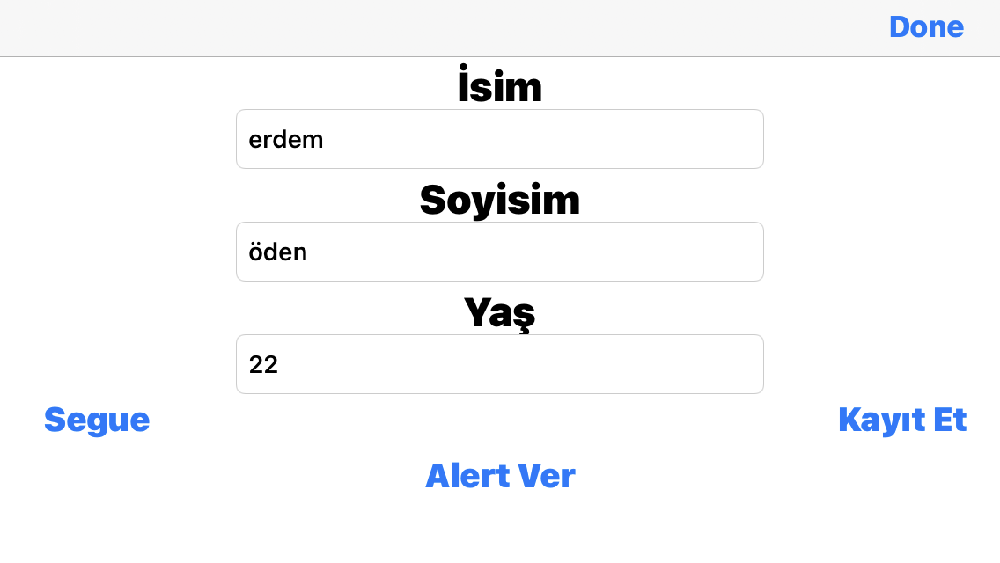

# deneme3

bu projede ilk sayfada isim textfield soyisim textfield ve yaş textfield alanları var.

alt kısımda da alert ver segue ve kayıt et butonları var.

Eğer segue butonuna basarsanız tableview olan alana gidersiniz.

Eğer isim soiyisim ve yaş alanlarını doldurup kayıt et e basarsanız,

Core data ile bu verileri kayıt etmiş olursunuz uygulamayı kapatıp açsanız bile bu kayıt kalacaktır.

Bunları yaptıktan sonra eğer tekrar segue ye basarsanız , bu sefer tableview da girdiğiniz isimin olduğunu

göreceksiniz. Aynı zamanda eğer tableviewdaki değeri sola kaydırırsanız değeri silebilirsiniz. Bu değeri 

Core datadan da silecektir.

Eğer alert vere basarsanız bir alertview karşınıza çıkacaktır ve sizden bir değer girmenizi isteyecektir.

değeri girip diğer sayfaya bastıktan sonra sizi diğer sayfaya gönderecektir.

Diğer sayfa da girdiğiniz değeri alt kısım da görebilirsiniz. timer başlat butonu ile timer başlatıp 

durdurabilirsiniz ve resim seç ile galeriden resim seçip o resimi dokunarak hareket ettirebilirsiniz

NOT( Açılan ilk sayfa da düzen responsive tasarım constraintslerle değil programlayarak swift ile yapılmıştır ve deneme 3 uygulaması 

telefonu yatay tutarak kullanmaya da uygundur test edebilirsiniz. Sadece tableview olan ve timer ın olduğu bölümlerde constrait kullanılmıştır ve eğer ekranınız yeterince büyük değilse eklediğim scrollview ile sayfayı aşağı kaydırıp gözükmeyen buton ya da labelları görebilirsiniz)

# Uygulama Resimleri

# -1-

# -2-

# -3-

# -4-

# -5-

# -6-

# -7-

